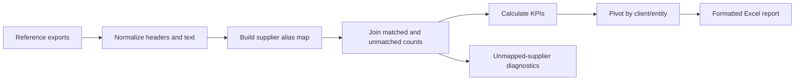

# Supplier-Client Prioritization Report

## Portfolio summary

This project replaces a recurring spreadsheet workflow with a reproducible report builder. It reconciles data from several export shapes, resolves supplier aliases, joins entity-level counts, calculates matching and coverage KPIs, and writes a formatted Excel report for prioritization decisions.

## Why it is interesting

The hard part is not the final pivot. It is making inconsistent operational exports agree:

- Column matching tolerates naming and encoding differences.
- Unicode NFKC normalization and mojibake repair protect join quality.
- Supplier aliases map display names and legal names to one reporting key.
- Batch duplicates use `MAX` for product totals rather than double-counting.
- Optional prior-period fields do not break a run when absent.
- Unmapped suppliers are emitted as an explicit diagnostic.
- The output separates manufacturer-level KPIs from client/entity blocks.

## Pipeline



## Input contract

The script expects a configurable `data_root` with these generic folders:

```text
sample_inputs/
├── supplier_reference/
├── unmatched_by_supplier_entity/
├── matched_by_supplier_entity/
├── dataset_metadata/
├── products_by_supplier/
├── client_entities/
├── relationship_rules/
├── prior_period_report/
└── match_timestamps/
```

No inputs are included in this portfolio export.

## Run locally

```powershell
pip install -r requirements.txt
python src/supplier_client_priority_report.py
```

To use the code with a new dataset, update the folder contract and column hints in `CONFIG`, then run against a non-sensitive fixture first.

## Transferable skills

Python, pandas, Excel automation, data contracts, entity resolution, data-quality diagnostics, reproducible reporting, and stakeholder-oriented metric design.
